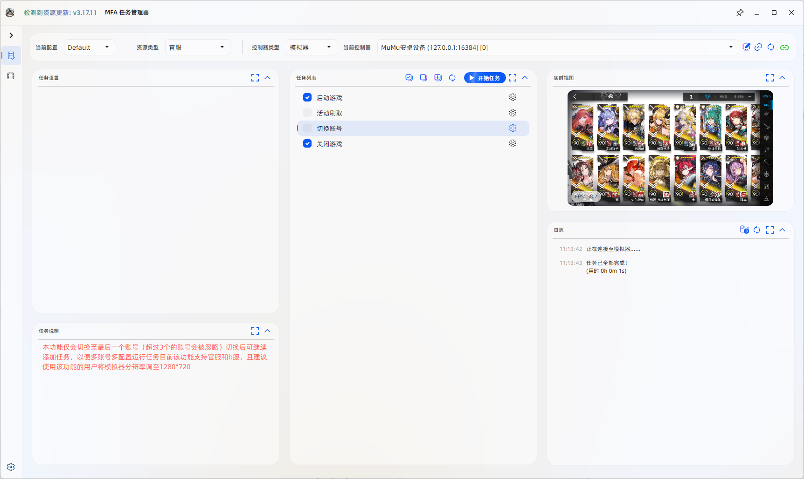

<!-- markdownlint-disable MD033 MD041 -->
<div align="center">
  

# MFAAvalonia

A cross-platform desktop interface for MaaFramework

[](./LICENSE)
[](https://dotnet.microsoft.com/)
[](https://github.com/MaaXYZ/MFAAvalonia)
[](https://github.com/MaaXYZ/MFAAvalonia/commits)
[](https://github.com/MaaXYZ/MFAAvalonia/stargazers)
[](https://mirrorchyan.com/zh/projects?rid=MFAAvalonia&source=mfaagh-badge)

**English** | [简体中文](./README.md)

</div>

## Overview

MFAAvalonia is a general-purpose [MaaFramework](https://github.com/MaaXYZ/MaaFramework) GUI built with [Avalonia UI](https://github.com/AvaloniaUI/Avalonia) and [SukiUI](https://github.com/kikipoulet/SukiUI). Resource developers describe tasks, options, controllers, and interface text through Project Interface V2, allowing users to configure and run automation tasks from a desktop application.

MFAAvalonia does not include application-specific resources. It is normally integrated into a MaaFramework-based resource project.

## Features

### Tasks and resources

- Supports Project Interface V2 tasks, options, presets, localization, `import`, `pretask`, and related capabilities.
- Supports text input, selectors, switches, and other task options, including expandable Markdown preset descriptions.
- Displays running, succeeded, failed, cancelled, or not-run state for each task, together with live and final elapsed time.
- Displays resource announcements and other Markdown content.

### Instances and automation

- Manages independent instances in tabs, with search, rename, instance ID copy, and instance configuration import/export.
- Supports schedules, batch actions at application startup, global hotkeys, and command-line automation.
- A running MFAAvalonia process from the same executable path can receive new command-line requests without starting a duplicate process.

### Controllers and platforms

- Provides release targets for Windows x64/arm64, Linux x64/arm64, and macOS x64/arm64.
- Supports MaaFramework ADB, Win32, and PlayCover controllers. Actual availability depends on the operating system, resource configuration, and packaged components.
- Supports light and dark themes and resource-defined localized interface text.

### Updates, notifications, and diagnostics

- Checks and installs application and resource updates through GitHub or Mirror Chyan.
- Accepts compatible local resource archives through drag and drop, then asks for confirmation before updating. Drag-and-drop updates are disabled while tasks are running.
- Supports DingTalk, Lark, Telegram, Discord, SMTP, WxPusher, QMsg, OneBot, ServerChan, and custom webhook notifications.
- Supports resource-configurable task dashboard layouts. See [Custom Layout](./docs/en/custom-layout.md).
- Resources can configure Sentry telemetry through PI. Diagnostic data is sent only when the resource provides telemetry settings and the user has not disabled "Help improve software."

## Preview

<p align="center">
  
</p>

## Requirements

| Item | Requirement |
|:---|:---|
| Runtime | [.NET 10 Runtime](https://dotnet.microsoft.com/download/dotnet/10.0). Official releases are framework-dependent by default |
| System | A Windows, Linux, or macOS system and CPU architecture matching the downloaded package |
| Resources | A resource project containing a valid `interface.json` and MaaFramework resource files |

Individual resource projects may require an emulator, ADB, another application, or additional system permissions. Refer to the documentation for the resource you use.

## Getting Started

### Project template (recommended)

[MaaPracticeBoilerplate](https://github.com/MaaXYZ/MaaPracticeBoilerplate) provides the standard MFAAvalonia integration workflow. Before developing a resource, read its [development guide](https://github.com/MaaXYZ/MaaPracticeBoilerplate/blob/main/README.md) and the [Project Interface V2 specification](https://github.com/MaaXYZ/MaaFramework/blob/main/docs/en_us/3.3-ProjectInterfaceV2.md).

MFAAvalonia is intended for configuring and running packaged resources. Use the MaaFramework development tools when debugging pipelines.

### Manual integration

1. Download the release matching the target operating system and architecture from [Releases](https://github.com/MaaXYZ/MFAAvalonia/releases), then extract it.
2. Place `interface.json`, resource files, and required components according to the Project Interface V2 directory conventions.
3. Install the .NET 10 Runtime and start the MFAAvalonia executable for your platform.

For a manual package, the MaaFramework native libraries, resource directory, and `interface.json` must match. The project template should be preferred for normal release packaging.

To provide a first-launch preset, place `config.template.json` in the package's `config` directory. It is promoted to `config.json` only when no other configuration JSON exists, including instance configuration under `config/instances`; updating an existing installation does not overwrite or add user configuration.

## Launch Parameters

MFAAvalonia can select instances and run tasks from the command line. An instance can be specified by name or instance ID. Copy an instance ID from the context menu of its tab.

```text
MFAAvalonia.exe [options]
```

| Option | Description |
|:---|:---|
| `-h`, `--help` | Show command-line help and exit |
| `-c <instance>`, `-i <instance>`, `--instance <instance>` | Select an instance by name or ID. Name matching is case-insensitive, and an exact instance ID match takes priority |
| `--autostart` | Run the tasks currently configured and selected in the target instance. If no instance is specified, the active instance is used |
| `-q`, `--quit-after-run` | Exit MFAAvalonia after the task started by this command finishes. Only effective with `--autostart` |
| `-f`, `--forceStart` | If the target instance is already running, stop its current task and start it again. Only effective with `--autostart` and an instance option |

### Examples

```powershell
# Show help
.\MFAAvalonia.exe --help

# Select an instance by name or ID
.\MFAAvalonia.exe --instance "Daily Tasks"
.\MFAAvalonia.exe -i 1a2b3c4d

# Run the selected instance automatically
.\MFAAvalonia.exe --autostart -i "Daily Tasks"

# Exit after the run finishes
.\MFAAvalonia.exe --autostart -i 1a2b3c4d -q

# Stop and restart the target instance if it is already running
.\MFAAvalonia.exe --autostart -i "Daily Tasks" --forceStart
.\MFAAvalonia.exe --autostart -c 1a2b3c4d -f
```

### Option combinations

- An instance option by itself only selects the target instance; it does not start tasks.
- If `--autostart` targets an instance that is already running, the new start request is skipped by default.
- With `--autostart`, an instance option, and `-f`, MFAAvalonia waits for the current task to stop before starting it again.
- `-q` tracks only the task started by the current command. When combined with `-f`, stopping the previous task is not treated as completion of the new run.

## Resource Development

- [Project Interface V2 specification](https://github.com/MaaXYZ/MaaFramework/blob/main/docs/en_us/3.3-ProjectInterfaceV2.md)
- [MaaPracticeBoilerplate](https://github.com/MaaXYZ/MaaPracticeBoilerplate)
- [Android Resource Project Integration](./docs/en/android-resource-integration.md)
- [Custom Layout](./docs/en/custom-layout.md)
- [External Notifications](./docs/en/external-notification.md)

The legacy `Advanced` configuration is deprecated. Current resources should migrate to Project Interface V2 and must not depend on legacy fields.

### MFAAvalonia extension fields

MFAAvalonia supports the following additional fields on Project Interface V2 `task` items:

| Field | Type | Default | Description |
|:---|:---|:---|:---|
| `repeatable` | `boolean` | `false` | Whether to show a repeat-count control in the task settings |
| `repeat_count` | `integer` | `1` | Initial repeat count. `-1` repeats until the user stops the task. Effective only when `repeatable` is `true` |

```jsonc
{
  "task": [
    {
      "name": "Repeatable task",
      "entry": "TaskEntry",
      "repeatable": true,
      "repeat_count": 1
    }
  ]
}
```

Repeat counts changed by the user are saved in the instance configuration.

### Announcement system

Place `.md` files in `resource/announcement/` to display them as resource announcements. Release notes for application or resource updates are downloaded separately and displayed in the update prompt.

### Custom icon

Place `logo.ico` in the `Assets` folder under the application root to replace the MFAAvalonia window and tray icons.

## Building from Source

Install the [.NET 10 SDK](https://dotnet.microsoft.com/download/dotnet/10.0), then run:

```powershell
dotnet restore
dotnet build MFAAvalonia.sln -c Debug
dotnet publish MFAAvalonia.Desktop/MFAAvalonia.Desktop.csproj -c Release -r win-x64
```

Replace `win-x64` with another RID supported by the project to build for that platform. Running the result still requires a valid resource directory and `interface.json`.

## License

MFAAvalonia is licensed under the [GPL-3.0 License](./LICENSE).

## Acknowledgements

MFAAvalonia uses open-source projects and services including [MaaFramework](https://github.com/MaaXYZ/MaaFramework), [MaaFramework.Binding.CSharp](https://github.com/MaaXYZ/MaaFramework.Binding.CSharp), [Avalonia](https://github.com/AvaloniaUI/Avalonia), [SukiUI](https://github.com/kikipoulet/SukiUI), [Serilog](https://github.com/serilog/serilog), [Newtonsoft.Json](https://github.com/JamesNK/Newtonsoft.Json), and [Mirror Chyan](https://github.com/MirrorChyan/docs).

Thanks to everyone who has contributed to MFAAvalonia.

<a href="https://github.com/MaaXYZ/MFAAvalonia/graphs/contributors">
  
</a>

<div align="center">

**If this project helps you, please give us a ⭐ Star!**

[](https://star-history.dera.page/#MaaXYZ/MFAAvalonia&Date)

</div>
